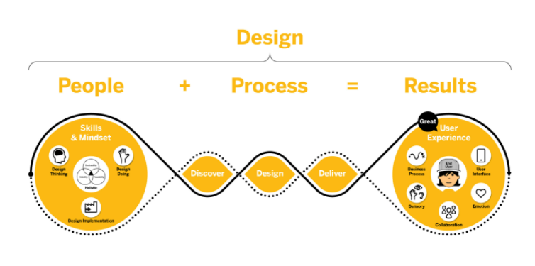
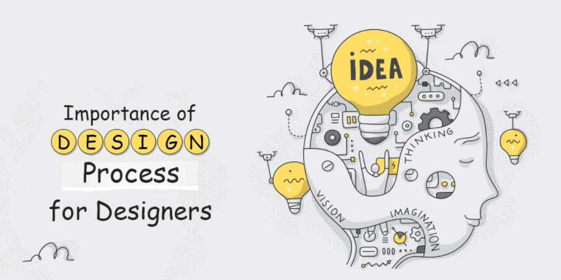

# WHAT IS DESIGN ? 

A design is a plan or specification for the construction of an object or system or for the implementation of an activity or process, or the result of that plan or specification in the form of a prototype, product or process. A design can also be considered as a plan to make something new for people, that they perceive as beneficial. In some cases, the direct construction of an object without an explicit prior plan such as in craftwork, some engineering, coding, and graphic design may also be considered to be a design activity. 

Design is at the service of the people. On the other hand, it takes the problem-solving aspect of science. It exists primarily to address a particular need. To quote Steve Jobs: “Design is not just what it looks like and feels like. Design is how it works.”. The design usually has to satisfy certain goals and constraints, may take into account aesthetic, functional, economic, or socio-political considerations, and is expected to interact with a certain environment. Major examples of designs include architectural blueprints, engineering drawings, business processes, circuit diagrams, and sewing patterns.
The design plays a most and much more important role in today’s different types of competitive global environment. A good type of design should be able to effectively communicate the overall message serving the purpose of it. 
Many still think design is there only to make things look good. But we’ve known for over a century now that good design is created when looks and function are developed together. Design isn’t about just visual skills or making things nice. It can be about life and death. Think of airplane controls—’Human error’ as the cause. Design happens in many professions and not just in product development. But design is about more than reducing engineering costs. Designers create plans for products that people want, need and like. It gives purpose to production beyond market mechanics. We can consider design to consist of the series of processes of thinking constantly about people most of all, identifying objectives, and planning ways to achieve them. It is believed that what is realized as a result of this process is one design solution.

- **Design is a Process**

Design is not just about products. It is about the way in which you arrive at the best results. The term “Design Thinking” describes an approach for the practical finding and resolution of problems. It combines empathy, creativity and rationality to meet user needs and drive business success. In the world of design thinking, design is a three-phase process of “discover, design and deliver.” Other companies use different words and different steps, but in general it is always the same. The key for success is iteration with customers and users from the beginning to the end.

- **Design Requires Skills and Mindset**

In order to complete all three phases of the design process, organizations require a new set of skills and mindset, including facilitation, coaching, brainstorming and idea generation (Design Thinking). In reality, additional skills are needed, including design “doing” and design “implementation”. With Design Doing, people engage with the end user, do user research and translate those observations into interaction design and visual design. This requires skills in psychology to understand what users really need (user research), prototype and mockup creation (interaction design), as well as color and typography (visual design). Design Implementation, meanwhile, requires UI development and coding capabilities in languages like HTML5.

- **Design Delivers Results**

The product or result of Design Thinking, Design Doing and Design Implementation is the user interface and user experience. The user interface is what the individual interacts with, like the screen on his phone or tablet, for instance. In most cases, you interact with the user interface in a physical way, most often through touch or sight. The user experience is the broader context in which the UI exists, taking into consideration the individual’s role in the overall process, how he or she collaborates with other people, and the environment in which the individual and the UI exist.

## Importance of Design Process

When designing user experience part, it is very important to develop and refine skills to understand and address rapid changes in users’ environments and behaviors. The world has become increasingly interconnected and complex. Design is what is bringing customers and business together. And it’s not just about the name and the logo that you choose, but rather an entire image or a feeling that a customer gets when dealing with the company. The design process is a multi-stage process. It involves creative phase as non-creative phases. Apart from creative ability, graphic designers need to develop other skills such as observation, research, coordination and management, technical knowledge. The design process is essential for a graphic designer, whether you are creating a website, creating a logo or creating any social media post.

### Steps to follow when designing something :

- **Design Brief**

Before beginning anything you just need to know exactly what client requirements and necessities. So, gathering the requirements from the client is very important. After collecting all the information you can reach out to them such as to ask project-related questions, and most importantly know their goals or objectives.

- **Research**

The research will always save you lots of thinking time. This step is crucial don’t skip as some time spent on research will give you an advantage. Research is one of the important factor which gives deep direction to the designers, or user research consultants.

- **Sketching**

It’s time to give some structure to the project. Before moving into a software such as an illustrator Photoshop, create a few simple hand-drawn sketches of the layout so this can enable you to design the project in faster pace of time.

- **Start Designing**

Now take the best idea of design and digitize it, either tracing over your illustrations or re-creating concepts on a computer to share it with the client.
Get busy with design software and start creating many versions of your selected sketches. Creating many variations of the design will allow you to present options to the client so they can pick the most suitable design. Try mixing and matching color palettes, typographic pairings to create variation.

- **Presenting your Design**

Present design in such way that your client get impressed instantly. Use mock-ups, which will help them visualize the overall result. Presenting a design efficaciously involves a great deal of confidence the key is to make your client believe that you are an expert in what you do so that they trust your designs and ideas.

- **Feedback**

Feedback is vital for visual designers,  and other types of creative professionals, as it provides them with an alternative point of view, critique or advice that will help them improve their design work.

- **Final Design**

Once the project is approved by the client then the final design can be submitted.

