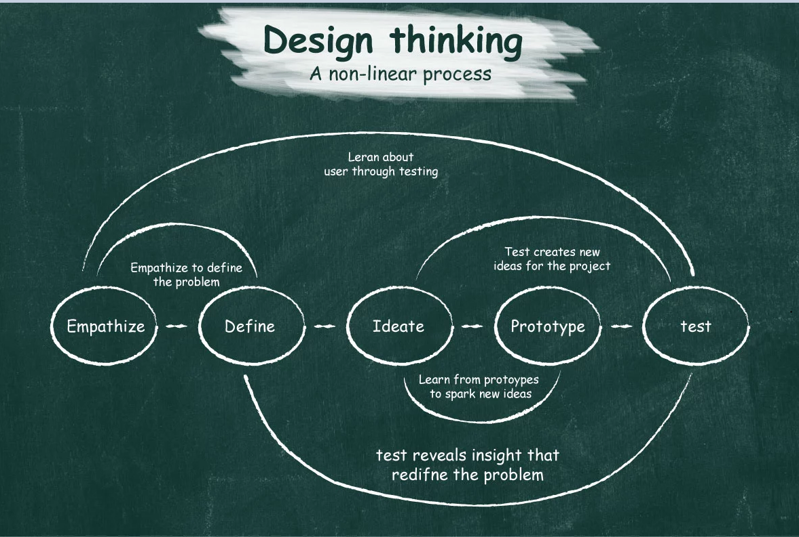
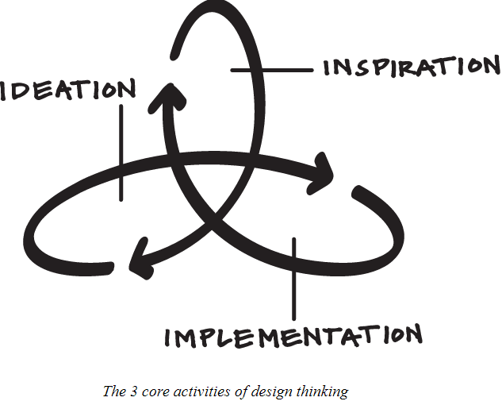
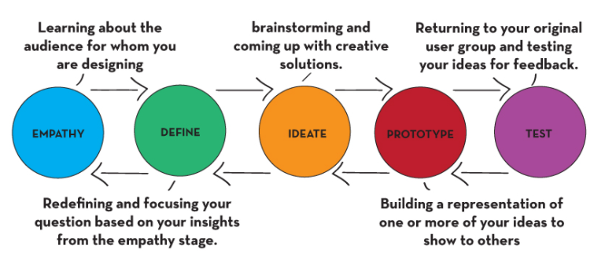

# WHAT IS DESIGN THINKING ? 

Design thinking is a non linear, iterative process that teams use to understand user, challenge assumptions, redefine problems and create innovation solutions to prototype and test. Design thinking uses creative activities to foster collaboration and solve problems in human-centered ways. It is a human-centered approach to innovation that draws from the designer’s toolkit to integrate the needs of people, the possibilities of technology, and the requirements for business success. Thinking like a designer can transform the way organizations develop products, services, processes, and strategy. This approach, which is known as design thinking, brings together what is desirable from a human point of view with what is technologically feasible and economically viable. It also allows people who aren't trained as designers to use creative tools to address a vast range of challenges. Design thinking is most useful to tackle problems that are ill-defined or unknown. To think like a designer requires dreaming up wild ideas, taking time to tinker and test, and being willing to fail early and often. The designer's mindset embraces empathy, optimism, iteration, creativity, and ambiguity. And most critically, design thinking keeps people at the center of every process. Design thinking involves five phases which are as follows :

  - Empathize
  - Define
  - Ideate
  - Prototype 
  - Test

 
Design thinking encompasses processes such as context analysis, problem finding and framing, ideation and solution generating, creative thinking, sketching and drawing, modelling and prototyping, testing and evaluating. Some of the core features of design thinking include the abilities to:

- resolve ill-defined or 'wicked' problems
- adopt solution-focused strategies
- use abductive and productive reasoning
- employ non-verbal, graphic/spatial modelling media

## Why Is Design Thinking so Important?

When designing user experience part, it is very important to develop and refine skills to understand and address rapid changes in users’ environments and behaviors. The world has become increasingly interconnected and complex. In 21st century organizations from a wide range of industries find design thinking a valuable means to solve problems for the users of their products and services. Designing teams use design thinking to tackle ill-defined/unknown problems because they can reframe these in human-centric ways and focus on what is most important for users. Of all design processes, design thinking is almost certainly the best for “thinking outside the box”. With it, teams can do better UX research, prototyping and usability testing to uncover new ways to meet users’ needs.

Design thinking’s value as a world-improving, driving force in business matches its status as a popular subject at leading international universities. With design thinking, teams have the freedom to generate ground-breaking solutions. Using it, we can get behind hard-to-access insights and apply a collection of hands-on methods to help find innovative answers.

## The Five Stages of Design Thinking

- Stage 1: **Empathize—Research Your Users' Needs**

  - generally the starting point
  - encourages students to ask great questions
  - learn about the audience for whom you are designing
  - collect examples of other attempts to solve the same issue
  - identify existing obstacles

 
Here, you should gain an empathetic understanding of the problem you’re trying to solve, typically through user research. Empathy is crucial to a human-centered design process such as design thinking because it allows you to set aside your own assumptions about the world and gain real insight into users and their needs.

- Stage 2: **Define—State Your Users' Needs and Problems**

  - redefine the deeper roots of the issue based on new knowledge from empathy
  - determine what will make this project successful
  - identify the needs and motivations of end-users

 
It’s time to accumulate the information gathered during the Empathize stage. You then analyze your observations and synthesize them to define the core problems you and your team have identified. These definitions are called problem statements. You can create personas to help keep your efforts human-centered before proceeding to ideation.

- Stage 3: **Ideate—Challenge Assumptions and Create Ideas**

  - generate as many ideas as possible to serve these identified needs
  - log your brainstorming session
  - do not judge or debate ideas as this limits creativity

 
Now, you’re ready to generate ideas. The solid background of knowledge from the first two phases means you can start to “think outside the box”, look for alternative ways to view the problem and identify innovative solutions to the problem statement you’ve created. Brainstorming is particularly useful here..

- Stage 4: **Prototype—Start to Create Solutions**

  - build a representation of one or more of your ideas to show others
  - combine, expand, and refine ideas
  - create multiple drafts

 
This is an experimental phase. The aim is to identify the best possible solution for each problem found. Your team should produce some inexpensive, scaled-down versions of the product (or specific features found within the product) to investigate the ideas you’ve generated. This could involve simply paper prototyping.

- Stage 5: **Test—Try Your Solutions Out**

  - seek feedback from a diverse group of people including end-users
  - review the objective and determine if the solution met its goals
  - avoid consensus thinking and ownership of ideas
  - discuss what could be improved

 
Evaluators rigorously test the prototypes. Although this is the final phase, design thinking is iterative: Teams often use the results to redefineone or more further problems. So, you can return to previous stages to make further iterations, alterations and refinements – to find or rule out alternative solutions.

These stages are different modes which contribute to the entire design project, rather than sequential steps.

