# ELEMENTS OF INTERFACE DESIGN

Identifying the goals, constraints, platforms, audiences will help shape the designs and help in developing the best possible visual solution for it. Color, type, and imagery is essential to making interfaces function clearly and seamlessly. Understanding the basic elements of UI design will get you a better sense of aesthetics, and build fast and beautiful UI components. So let’s see what basic elements of UI design we need to know.  Prior to designing these solutions, there exist some key fundamental elements that we should keep track of: 

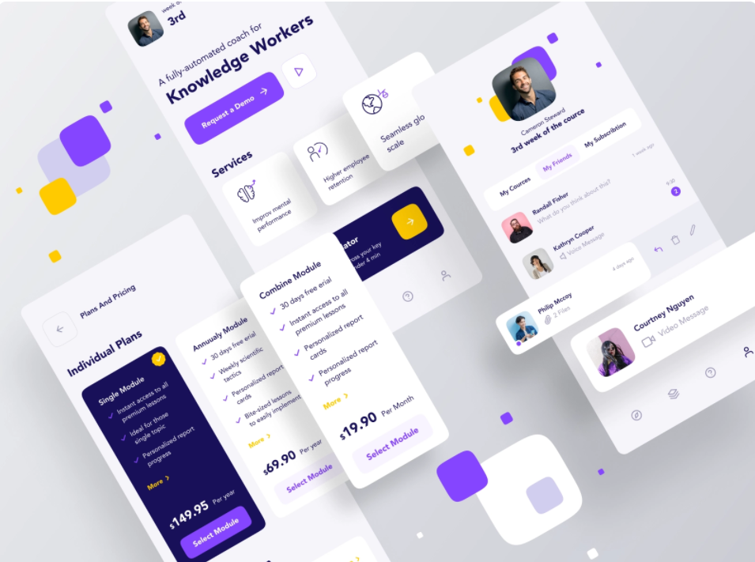

## 1. Language

There are different ways in which we can work with words within our project:

- **Word as Naming/Branding**

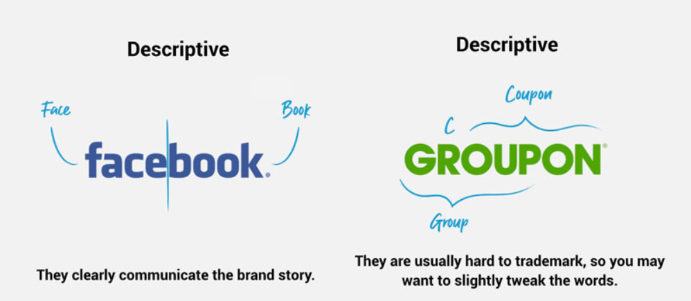

When we consider language as a design tool, naming is the first thing that comes to our mind. A product’s naming has the power to set the mood at the very entry level of the brand’s experience. The right name needs to be timeless, tireless, easy to say and remember. How do you find a name that grabs people’s attention? A great name stands for something and facilitates brand extensions. Its sound has rhythm and it looks great in the text of an email and in the logo. When your new brand name works as a shortcut for people to make great decisions. A great name is the fastest and easiest way for people to navigate the choice of a brand, or product, or service, when they need it most. Names are way-finders, used by people to locate and choose you over your competitors. In them, they carry so many attributes, associations, experiences, and information that people immediately understand and accept. A great name conveys all of this in a single word or phrase. Well-known descriptive brand names examples:

- **Word as Tone/Attitude**

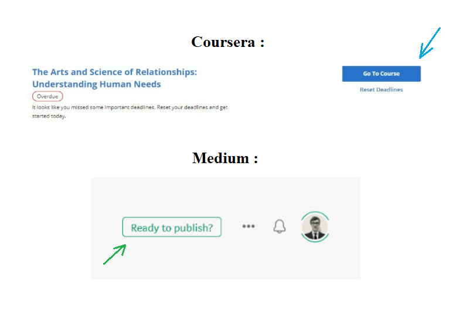

It’s quite useful to come up with a set of words that can be applied to every design direction you have. Tones vary with your brand’s intent and decisions on whether they should be strict, scientific, friendly, entertaining, fun or playful should align with those intents. Tone is attitude. It's how a writer approaches readers and the type of emotion they want to transmit. Tone can be of different types like playful, enthusiastic, confident, warm, flattering, respectful, honest, succinct, friendly. Tone in writing is the attitude that the writer conveys to the reader. It's not necessarily what you say, but how you say it. Tone is intended to create a specific response or emotion in the reader; it creates a personality that can either engage or repel users.

##  2. Colour

Colour also sets the mood for your interface as humans generally respond to them in a very emotive and subjective way. Since colour is both relative and subjective, we have to figure out how to control that subjectivity a little bit in order to get it to do what we want it to do for our interface that is create the intended atmosphere, mood or function. One of the basic and extremely important factors that cannot be ignored is color. For example, when you visit a website, the first thing that catches your eye is not the layout, not the content, but the color of the page. Therefore, the choice of color is quite an important job and requires high aesthetics of the designer. We will not go too deep, but let’s take a look at the following notes: 

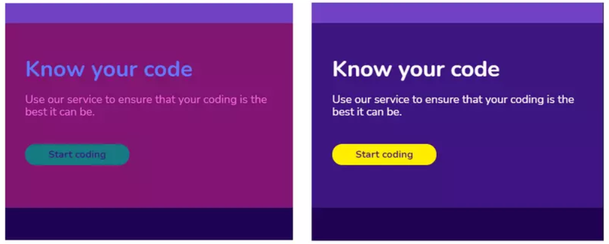

**It is necessary to choose the right color for the topic :** each color can have a symbolic meaning, for example, green often represents nature, prosperity … or black, Therefore, should consider choosing colors depending on the target user, the product, or the type of business of the company. 
**Do not use too many colors on the same interface :** too many colors can confuse the user, losing the expressive purpose of the interface element. Often for easier and safer, we should only choose 1 or 2 main colors, and then mix with different shades (shades) to create harmony. 
**Pay attention to match contrast properly :** as mentioned above, good contrast makes it easier to see, and color plays an important role in contrast coordination. 
Let’s count how many colors are in the picture on the left, maybe you can count 4, if you have 5, or more broadly, give 6. From here, you can see that the important elements are not prominent. , if not difficult to see, because the use of too many colors and partly because the contrast between these colors is not good. On the right image, here I see 3 colors, the background color I calculated completely is 1 color, just different shades, the second color is the font color, the third color is the button. You can easily see where is the button you can press, where is the text you can read.

- **Colour as Mood**

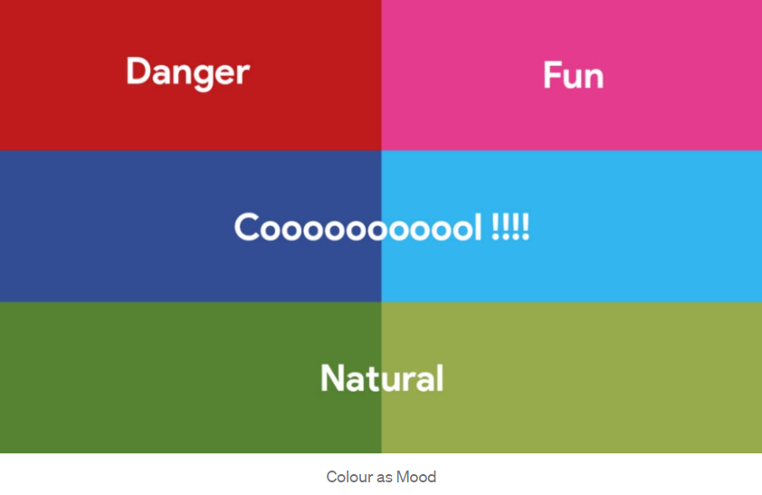

When we have a purely black and white creative, we often admit the connotations with such as very serious, and that stems from cultural connotations of black and white printing in newspapers and early photography. By adding a simple vibrant colour to the creative, we can immediately change such connotation.
It is safe to know that some connotations come from real world while some were fabricated. Pink representing boys and blue representing girls is an example of a cultural convention.

- **Colour as Navigation**

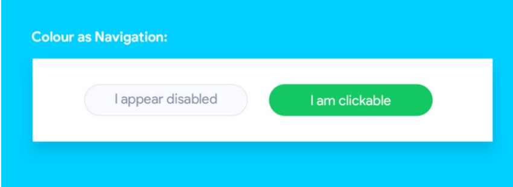

In terms of function, colour can be used in a variety of ways but most prominently as a navigation in our interface. Taking a look at the 2 buttons below, it becomes immediately apparent which of them is passive and which is active. We can also use colour to show states like passive (inactive), active (touch/hover), activated (press/click) and many others.

## 3. Imagery

Imagery can come in different styles: shapes, illustrations, photography, 3D renderings, e.t.c. But whatever the style, they can serve as content, mood, and navigation in the context of an interface design.

- **Imagery as content**

Imagery can serve as content in our interfaces in 2 primary ways: 

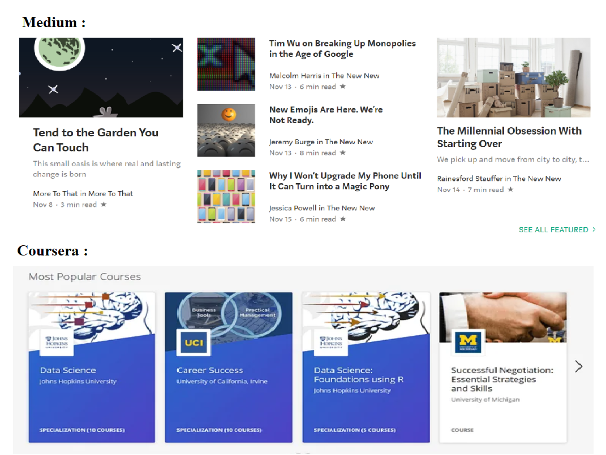

**Contained imagery:** where the imagery exists in some form of grid or frames. This type of imagery is usually for delivering some sort of content to the intended audience. Examples include product images in an e-commerce site search results, a grid showcasing a hierarchical category of some sort.
Contained imagery provides a very functional comparative structure that is very useful when you need to work across contents that need to be searched or that need to work across a lot of different sized platforms.  

**Immersive imagery:** where the imagery exists as a design element in itself, breaking out of the box and being in its own world. This is usually common for games, apps, animations and many others.

- **Imagery as mood** 

Imagery can help to set a tone or ambience that the audience can relate to. Usually, brands do have a style guide that explicitly states what type of images to be used and how they should be used across an entire brand experience.

- **Imagery as navigation**

Asides the aesthetic function, imagery can also serve as a navigation. This is very common in the e-commerce space. For instance, on the Balenciaga product page, imagery serves as the main navigation element. Imagery as navigation also has immense usefulness in geospatial sectors.

## 4. Typography

People got used to receiving the majority of information in text form and designers need to make this process easy and productive. The basic knowledge of typography can help to comprehend the peculiarities of font visual presentation and its influence on users perception. Use typeface that is consistent, suitable for its intended use, and compatible with other elements. Often on the same interface should only use 1 or 2 fonts to ensure consistency, users look more familiar. And depending on the intended use, you should choose the right font and font style, for example, you are working on a furniture site, you are using a street-style font like graffiti, and so on. It’s not about being creative The problem with the image on the left is using too many typefaces (one style header, one style content, one style footer) and the size is not good either because of the typography, or the designer’s fault. After switching back to the same typeface and tweaking something like in the image on the right, does it look a little better?

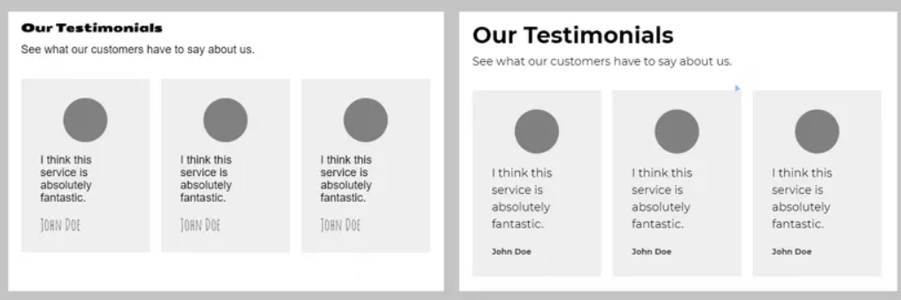

Type can work in many different ways in the context of an app or a website. This includes working as content that we consume, as part of an interface in terms of buttons or labels or as part of a branding system to give your product a recognisable identity. If fonts are badly legible, people can face problems with navigation or even worse can’t use it at all. Today poor user experience in digital products is unforgiven since users can easily find the better alternative.
In addition, bad typography significantly affects the first impression because even when users don’t read copy, they scan it. In case fonts look inappropriate people may not want to learn about your offer or use your product.

- **Typography as content**

Content consumption can be in form of text, videos, audios e.t.c But text is quite better in some areas than these other forms. Think of how to represent the word “ambiguous” with an imagery or video. Type comes to the rescue when it becomes difficult to depict certain representations. Type is fast, accurate and economical (in terms of a screen real estate).

- **Typography as interface**

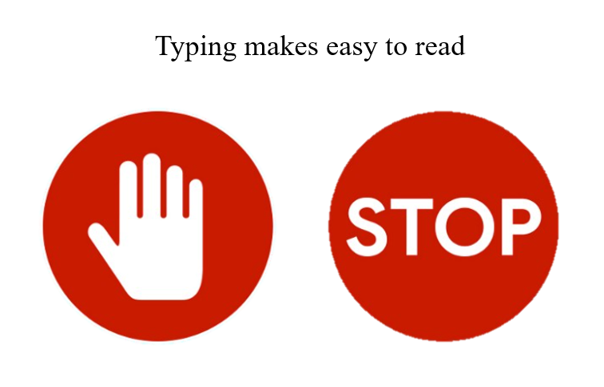

Text needs to have a visual form and a typographic representation. So, it becomes a design problem. Typography also determines readability. Semantically, type is also less ambiguous when trying to depict some representations.
For instance, in the image below, STOP only means one thing: there’s absolutely no gray area there. There’s no different interpretation, and this can be very useful in terms of designing an interface. Language is very economical in terms of its meaning and has a great deal of flexibility in terms of how it works that imagery cannot compete with. So, words are great for the accurate representation of complex non-visual concepts and this is great for an interface designer because quite often, we’ll be trying to show things that are complex non-visual concepts, and these appear in a lot of different places, in menus, naming, buttons, instructions e.t.c Type is everywhere in our interface because it’s still the fastest and most accurate way we have to communicate complex and specific ideas.

- **Typography as branding**

Type here is less about content or connotation but more of identity and individuality. The aim here really is to have a typographic visual brand that helps your product stand out. For Google, that could be settling for Product Sans as their default brand type. For this function of type as a branding element, it works closely with colour and sometimes icons.

## 5. Icons

Generally, icons vie for visual interests and recognizability. One of the things that people often get confused about is the difference between an icon and a symbol.

- **Icon vs Symbol**

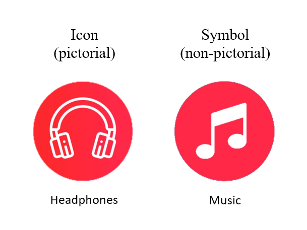

An icon shows us a visual representation of a thing that is relatively realistic compared to what the thing is. But a symbol doesn’t necessarily look like the thing that it represents. An icon is pictorial, a symbol is non-pictorial. It will be hard to represent something as broad and something as abstract as music with a fixed single visual image.

- **Icon as interface**

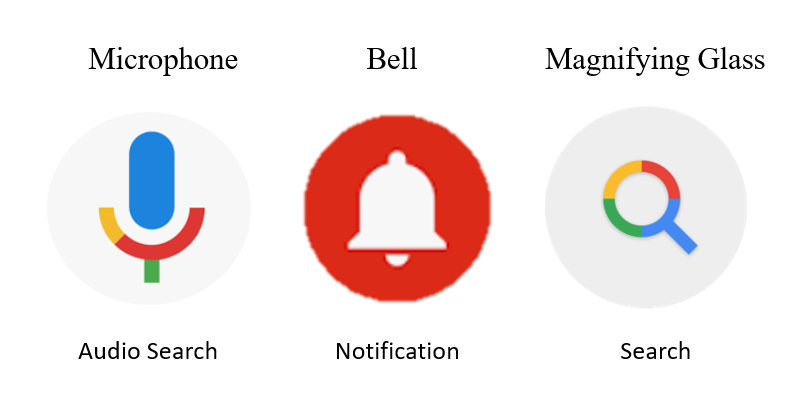

Icons and symbols act as interface elements by representing certain actions. For instance, the notification icon on Youtube looks like a bell, so it represents that by using a symbol, it stands for the idea or concept of notifications. A very common example is mic icon used in google search engine that acts as a microphone. It’s used when we want the webpage to accept voice as input.

 
- **Icon as branding**

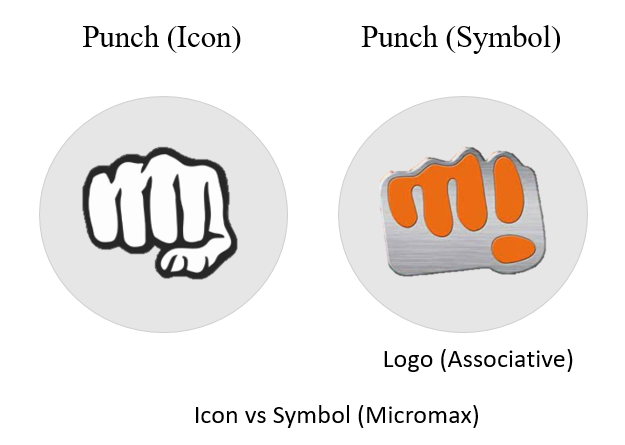

Icons and symbols can act as instant representatives of a product, brand or company. Consider Micromax logo with a punch line nothing like anything reflects the young company's innovatve, dynamic, bold yet fun elements. The logo does not only represents a punch sign but also has it's first two letters 'M' and 'I'. . The connection and familiarity we draw to this is a manifestation of how a symbolic representation can totally eclipse the literal depictive value of an icon. The success here relies on combining what is commonly obvious with what is learned or associative.

## 6. Visual Hierarchy

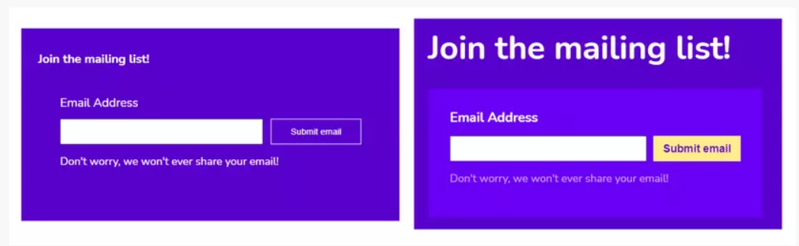

This highlights the function and purpose of the elements on the interface. The most obvious example is the slider, where when scrolling the slider, the image in the middle will be larger than the pictures on the sides, which helps you focus more on the image. It’s a way of highlighting an element using the visual hierarchy. The figure on the left is an example when without applying the visual hierarchy, the elements look the same, without emphasis. In the right image, the elements are highlighted, clearly showing their functions and purposes by applying the visual hierarchy. 

## 7. Scale

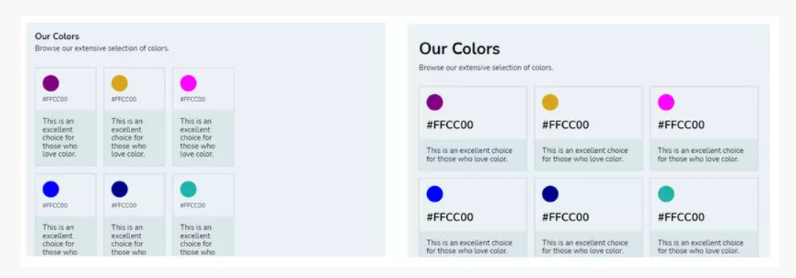

Consider using the appropriate size for the element as well as the intended use of the element. A simple example is, when you see an article, the first thing you care about is the title because it generalizes what the article says. If the title is not interesting, you immediately next, save a block of time. Therefore, the title should be larger, more prominent than the text in the body.  The image on the left, the elements are almost the same font size, we don’t know what information we need to select to save in the head, and the color frames don’t cover the full width of the page, looking uneven. In the picture on the right, we can distinguish what this page is titled, each color has a clear color code that makes it easy to remember and the color frames look ok.

  