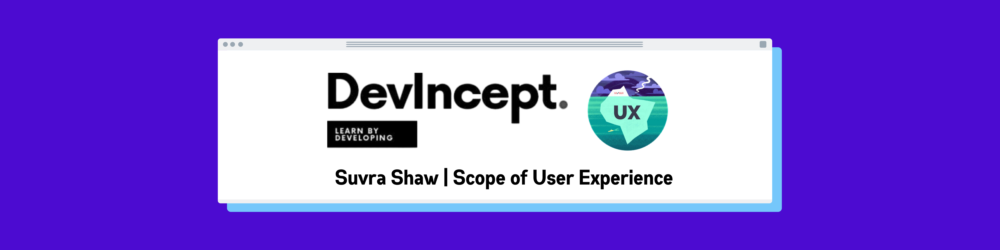
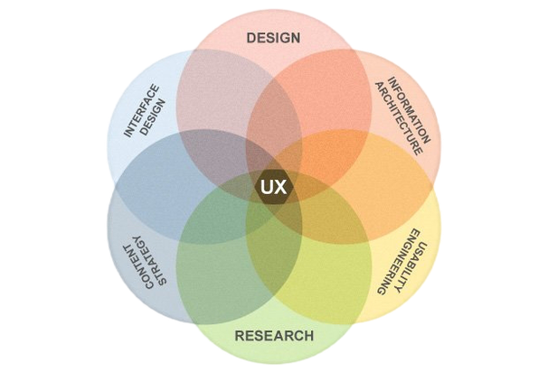
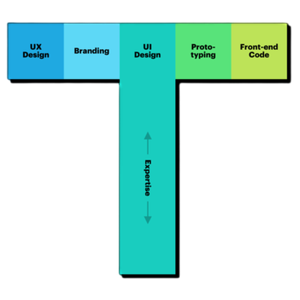

# The Scope of User Experience

> When UX design first became popular, it was met with a lot of criticism. People believed that their user experience would be insignificant. However, they weren't entirely wrong at the time. The majority of older web applications were simple and static. As a result, focusing on user experience did not appear to be a priority.

> Web applications, on the other hand, have come a long way since then. Web applications have progressed in recent years, becoming more dynamic and complex. For users, this adds to the complexity. As a result, there's a pressing need to consider user experience.

> [As of January 2021, almost 60 per cent](https://www.statista.com/statistics/617136/digital-population-worldwide/) of the world's population uses the internet, according to Internet World statistics. This equates to a population of 4.8 billion people! Organizations are using this to their advantage in order to reach out to a larger audience via the internet. Today, almost every business has a presence on the internet. Because of the internet's reach, offline businesses are also looking to go online. This is why UI UX design is so important today.

- ### So, What are some of the current job aspects in the UX domain?  —
    - **Research** – It's all about getting to know the people who use your product. You'll learn about the users' backgrounds, demographics, motivations, pain points, emotions, and goals through research. Surveys, observations, and interviews could all be used in your research.
    - **Information Architecture** – It entails deciding on the organisation and structure of your product. Consider it as a skeleton for how users will interact with your product. Everything in your product should be organised in a way that the user understands and that meets their expectations.
    - **Effective Communication** – It entails exchanging emails, meetings, presentations, and design software with your coworkers. Because UX design is such a collaborative field, being able to communicate with your teammates both digitally and face-to-face is crucial. You must be a good listener, receptive to feedback, and articulate your thoughts.
    - **Visual Design** – It focuses on the appearance of the product or technology. To communicate the connection between a product's functionality and its appearance to users, you need to understand the foundations of visual design as a UX designer.

- ### Also, What kind of UX job role could you be?  —
    - **A Specialist** – A specialist becomes an expert in one type of UX design, such as interaction, visual, or motion design. UX specialists are more common in large companies with a large number of designers, such as Google. The following are some of the advantages of becoming a specialist:
        - Concentrating on one type of design that you prefer over others.
        - Developing a thorough understanding of a single design type.
        - Developing a reputation in the industry for your knowledge of a specific type of design.

    - **A Generalist** – A generalist is responsible for a wide range of tasks. The majority of UX design jobs are generalist positions, especially in companies with a small number of UX designers. Entry-level UX designers typically work in generalist roles, and some people choose to stay in generalist roles for the rest of their careers. Being a generalist UX designer has many advantages, including:
        - Developing your skills in a variety of UX projects.
        - Trying a variety of responsibilities and identifying a UX area in which you have a particular interest.
        - While performing a variety of tasks, keep your job feeling fresh and new.

    - **T-shaped** – It is a specialised designer with a wide range of skills. The stem (or vertical line) of a T represents their expertise in one area, while the top (or horizontal line) represents their related skills in a wide range of fields. T-shaped designers are excellent additions to any team because they combine the strengths of specialists and generalists.

> We've talked about UI UX's past and present. So, how does the future look? Some argue that everything in UI UX will be explored at some point in the future and that there will be nothing new to do. "*Do I expect the same things from a web application today that I expected from web applications 5-10 years ago?*," asks the question. No, your expectations have shifted significantly as web applications have progressed. As a result, as time passes, users' expectations will change.
